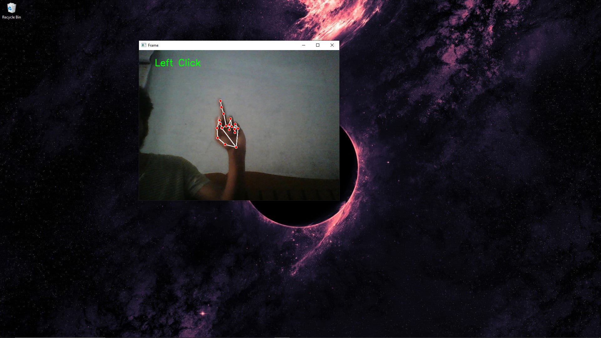
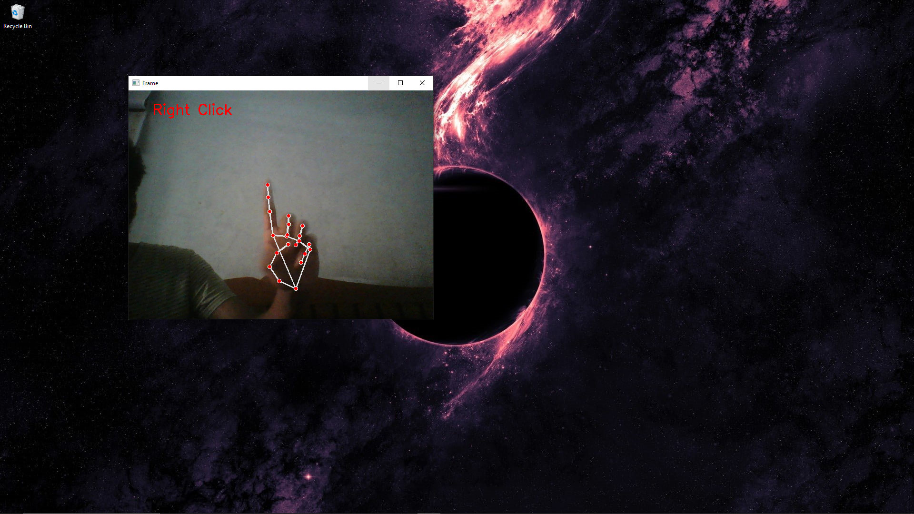
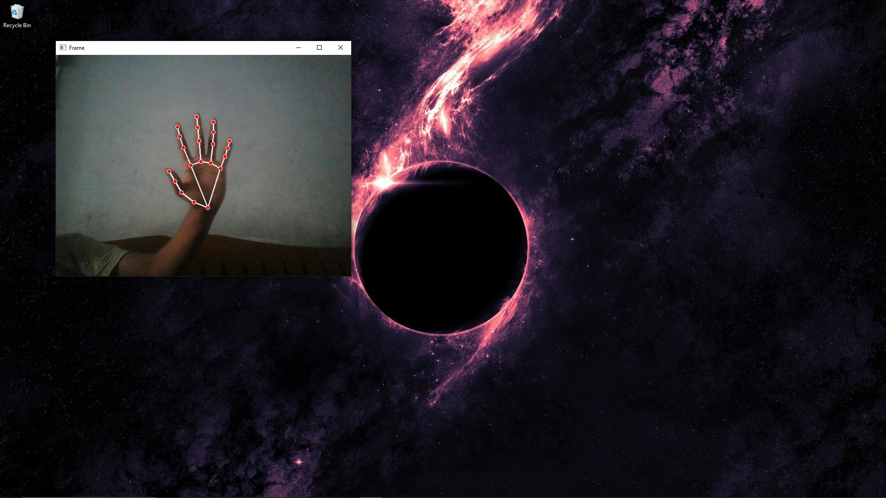

# Hand Gestured Virtual Mouse 
This project implements a hand-gesture-based virtual mouse that allows users to control mouse functions with just their hands, without the need for any additional hardware. Using computer vision and hand-tracking techniques, the application detects hand gestures to perform basic mouse functions like moving the cursor and clicking.To detect Hand gesture movements this system make use of desktop webcam.

This approach enables hands-free interaction with a computer, making it particularly beneficial in hygiene-sensitive environments.

## Gestures

## Project Flow
- first gesture is captured through webcam and processed 
- The captured frames are processed using OpenCV to detect the hand gesture.
- MediaPipe is used to extract key hand landmarks
- Different hand movements are linked to specific mouse functions.
- PyAutoGUI translates the recognized gestures into cursor movements and clicks
- Mouse function will performed

### To run this project 

- Clone this repository into your local machine 
- Make sure you have installed all required libraries 
- Required libraries : OpenCV, PyAutoGUI, MediaPipe, pynput.
- Run it.
